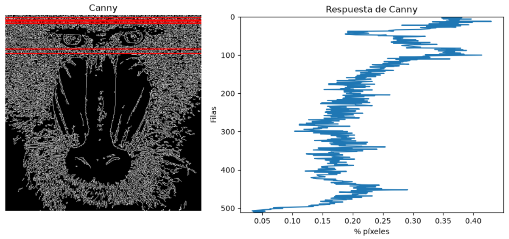
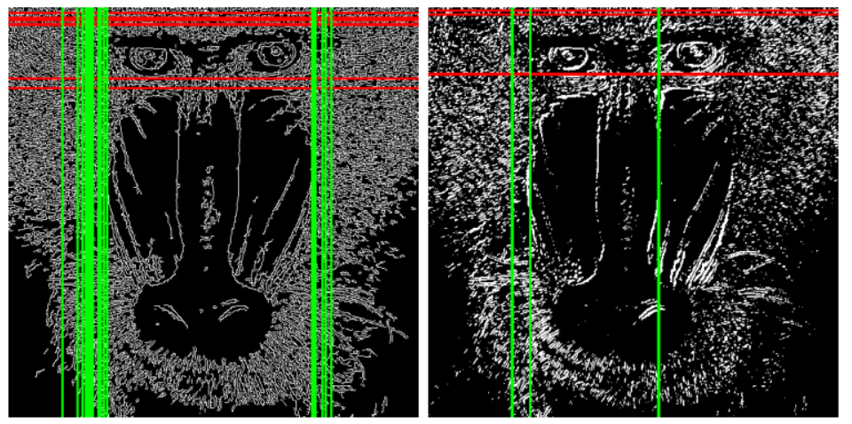

# Práctica 2

Este repositorio contiene el cuaderno `VC_P2.ipynb`, con tres ejercicios sobre detección de bordes (Canny y Sobel) y una aplicación de control de audio por gestos.

### Autores:
- [Sergio Rodriguez Rubio](https://github.com/SergioRodriguezEnt)
- [Arael Jesús Almeida González](https://github.com/xAraelx)

------

## Estructura de la carpeta

```
P2
|- AmpliacionTarea2_P2.mp4    #Video demostracion de la ampliacion de la tarea 2
|- mandril.jpg                #Imagen base para las tareas 1 y 2
|- musica.mp3                 #Música controlada en la tarea 3
|- README.md                  #Descripción de la solución a las tareas
|- ResusltadoTarea1_P2.png    #Imagen del resultado de la tarea 1
|- ResusltadoTarea2_P2.png    #Imagen del resultado de la tarea 2
|- ResusltadoTarea3_P2.mp4    #Video del resultado de la tarea 3
|- VC_P2.ipynb                #Cuaderno jupyter con tareas desarrolladas
```

## Recursos necesarios

Se puede usar el mismo *environment* de la práctica 1 (OpenCV, NumPy, Matplotlib y Pillow). Para la tarea 3 hay que instalar además los paquetes `sounddevice` y `soundfile`:

- `%pip install sounddevice soundfile`

RECORDATORIO: el cuaderno ya incluye una celda para instalar estos paquetes.

La parte en vivo de la tarea 2 y la tarea 3 necesitan una **cámara web**.

------

## Tarea 1 — Conteo de píxeles blancos por filas con Canny

La imagen se convierte a escala de grises y se le aplica `cv2.Canny(gris, 100, 200)`, obteniendo una imagen binaria (0/255) con los bordes detectados.

Para el conteo se ha creado la función genérica `getBorderDataBy(gray, img, factor, "row" | "col")`, que:

1. Suma los valores de cada fila (o columna) con `cv2.reduce` (`dim=1` para filas, `dim=0` para columnas).
2. Obtiene el valor máximo de la cuenta (`maxfil`).
3. Selecciona con `np.argwhere` las filas cuya cuenta es `>= factor * maxfil` (con `factor = 0.9`).
4. Dibuja sobre la imagen de Canny una línea roja en cada fila seleccionada (o verde, si se trata de columnas).

**Resultado con `mandril.jpg`:**

| | |
|---|---|
| `maxfil` | 56100 (220 píxeles blancos × 255) |
| Filas `>= 0.9*maxfil` | 7 |
| Índices | 6, 12, 15, 20, 21, 88, 100 |




Las filas destacadas corresponden a la frente (pelaje con mucha textura) y por debajo de la línea de los ojos. Además, se muestra una gráfica con el porcentaje de píxeles blancos de cada fila.

## Tarea 2 — Umbralizado de Sobel y comparación con Canny

La función `getBorders(img, valorUmbral)` calcula para una imagen:

- **Canny** con umbrales 100 y 200.
- **Sobel umbralizado** con `cv2.threshold(sobel8, valorUmbral, 255, cv2.THRESH_BINARY)`.

A continuación, `getBorderData(img, factor)` reutiliza `getBorderDataBy` para contar por filas y por columnas, y `showBorderData` muestra los índices y la imagen con las filas (rojo) y columnas (verde) destacadas.

**Resultados con `mandril.jpg` (umbral 110, factor 0.9):**

| Método | Filas | Índices de filas | Columnas | Índices de columnas |
|---|---|---|---|---|
| Canny | 7 | 6, 12, 15, 20, 21, 88, 100 | 19 | 67–123 (13 col.), 379–403 (6 col.) |
| Sobel umbralizado | 4 | 3, 8, 82, 83 | 5 | 104, 105, 127, 287, 288 |



**Comparación:**
- Canny produce bordes finos (1 píxel) y continuos gracias a la supresión de no máximos y la histéresis. Sobel umbralizado produce bordes más gruesos y fragmentados.
- Sobel es más sensible a la textura del pelaje y depende mucho del umbral elegido.
- Al sumar `sobelx + sobely` con signo, algunos bordes diagonales se compensan y se pierden. Usar la magnitud del gradiente daría una respuesta más uniforme.
- Ambos métodos coinciden en las filas de la frente y de los ojos. En columnas, Canny marca más posiciones, agrupadas en los laterales del pelaje.

Por último, hay un **demostrador en vivo con la cámara** que muestra un collage 2×2 con la imagen original, Canny, Sobel y Sobel umbralizado, todos con sus filas y columnas destacadas. Las barras *Umbral* y *Factor* permiten ajustar los parámetros en tiempo real. Se sale con `ESC` o `q`.

▶ [Ver vídeo de la demostración de la ampliación tarea 2 (YouTube)](https://youtu.be/xV2-gCCpJ0gE)

📥 [Descargar vídeo](AmpliacionTarea2_P2.mp4)


## Tarea 3 — Demostrador: control de la música con las manos

Tomando como inspiración *Virtual air guitar* y *Messa di voce*, se propone un demostrador en el que las manos controlan una canción que suena de fondo:

- **Mano en la zona izquierda** → volumen (0–100 %).
- **Mano en la zona derecha** → velocidad de reproducción (x0.25 – x2).

**Procesamiento de la imagen:**
1. El fotograma se invierte en espejo, se suaviza y se convierte a **YCrCb**.
2. Se segmenta el color de piel con `cv2.inRange` y se limpia la máscara con apertura y cierre morfológicos.
3. La imagen se divide en tres zonas verticales y en cada una se cuentan los píxeles de piel, de forma similar al conteo de las tareas anteriores.
4. En las zonas laterales se localiza la primera fila con suficientes píxeles de piel (la parte más alta de la mano), y su altura se convierte en un porcentaje entre dos márgenes.
5. El valor se filtra con suavizado exponencial y una zona muerta para evitar temblores.

El audio se carga en memoria con `soundfile` y se reproduce en bucle con `sounddevice`. En el *callback* se avanza por las muestras a la velocidad actual, interpolando linealmente entre ellas.

El código del audio se desarrolló con ayuda de Claude: [conversación con Claude](https://claude.ai/share/c30abf0d-8d17-42cc-a46a-0f5d5610e200).

**Controles:**

| Tecla | Acción |
|---|---|
| `c` | Calibrar el color de piel con la muestra del cuadrado central |
| `+` / `-` | Ampliar / reducir el rango de color de piel |
| `r` | Restaurar el rango inicial |
| `v` | Alternar entre la cámara y la máscara de piel |
| `q` / `ESC` | Salir |

▶ [Ver vídeo de la demostración de la Tarea 3 (YouTube)](https://youtube.com/shorts/-0ec3Tz8ElE)

📥 [Descargar vídeo](ResultadoTarea3_P2.mp4)

------

## Créditos de la música

Música usada: *We Shop Song* - Philip Milman
Creative Commons ► Attribution 3.0 Unported ► CC BY 3.0
https://creativecommons.org/licenses/...
"You are free to use, remix, transform, and build upon the material
for any purpose, even commercially. You must give appropriate credit."

Composed by
Philip Milman ► https://pmmusic.pro/

## Referencias

- [Guía de la Práctica 2](https://github.com/otsedom/otsedom.github.io/tree/main/VC/P2)
- [Documentación de OpenCV](https://docs.opencv.org/)
- [Documentación de sounddevice](https://python-sounddevice.readthedocs.io/)
